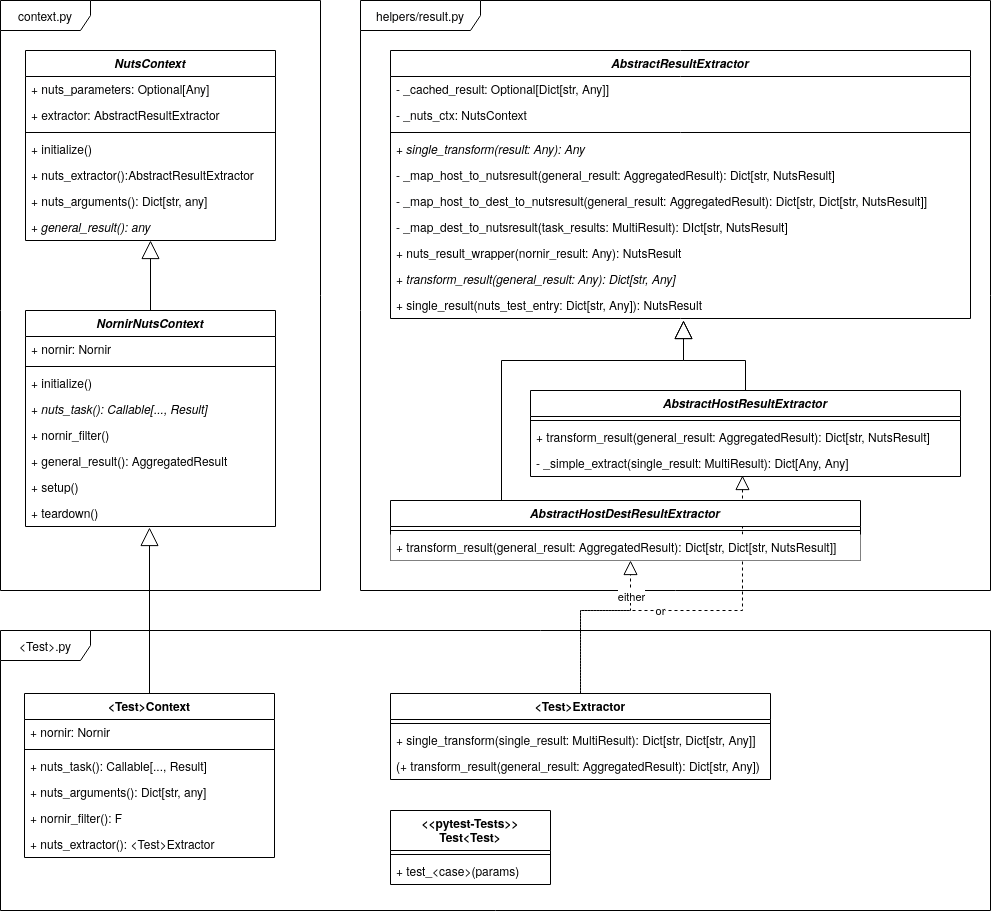

How To Write Your Own Test
==========================

Nuts is written as a `Pytest plugin <https://docs.pytest.org/en/6.2.x/writing_plugins.html>`__ and allow you to write your own tests, apart from the existing ones in ``nuts/base_tests``. The short introduction here shows you the required ingredients to cook up your own tests.

Three classes are needed for a test - they define the context in which a test is run, process raw data and then run the tests:

1. Context class: Holds all necessary information that is needed for a specific test. Yields the raw, unprocessed result. Base class: ``NutsContext``
2. Extractor class: Processes the raw overall results from a network query (very often a nornir task), so that it can be passed on to the test class. Base class: ``AbstractResultExtractor``
3. Test class: Contains the actual test methods. They test data from the YAML file against the retrieved and processed data from the network.

A Simple Test 
-------------

The project features a showcase that displays the most basic test possible, one that also works without a network to gather data. You find the module that contains the code in ``tests/showcase`` and the test bundle (the YAML file)  in ``tests/showcase_test``. 

Writing the Test itself
.......................

The showcase test implements the three above-mentioned classes and the necessary methods:

1. ``ExpanseContext`` derives from ``NutsContext``.
2. ``class ExpanseExtractor`` derives from ``AbstractResultExtractor``.
3. ``class TestExpanseCrew`` is the actual test class.

The context to be used by nuts is defined by setting ``CONTEXT = ExpanseContext``.

Here's a code snippet from ``class TestExpanseCrew`` to illustrate how the test class is written:

.. code:: python

    class TestExpanseCrew:
    # ...
    @pytest.mark.nuts("name, role")
    def test_role(self, single_result: NutsResult, name: str, role: str) -> None:
        assert single_result.result[name]["role"] == role

``@pytest.mark.nuts("name, role")`` is a `custom pytest marker <https://docs.pytest.org/en/6.2.x/example/markers.html>`__: The arguments ``name, role`` refer to the fields as they are defined in the YAML file under ``test_data``. They are then passed on as a pytest fixture to the test itself.

Writing the YAML-File
.....................

The sample YAML file that uses the test has the following features:

    * ``test_module`` directly refers to your module and its location.
    * ``test_class`` is the name of the test class you have defined in step 3 in the previous section.
    * ``test_data`` contains the data against which the tests should be run. Be aware that the fields under ``test_data`` and those used in the test class itself must match, i.e. the arguments in the custom pytest marker. 

Fields in ``test_data`` are optional except for the key into the results (``ship`` in our case here, usually ``host``). If you leave out other fields than the key, the test that requires that particular entry will be skipped. The following snipped comments out ``origin``, which therefore skips ``test_origin()`` for Bobbie Draper.

.. code:: yaml

    - ship: rocinante
      name: "bobbie draper"
      role: marine
      # origin: mars

A Test Using Nornir
-------------------
To illustrate how this test works, the BGP test module (``nuts/base_tests/napalm_bgp_neighbors.py``) shall serve as an example. The test module implements these three classes:

    1. ``BgpNeighborsContext`` derives from ``NornirNutsContext``.
    2. ``BgpNeighborsExtractor`` derives from ``AbstractHostResultExtractor``.
    3. ``class TestNapalmBgpNeighborsCount`` is the actual test class.

The context to be used is defined by setting ``CONTEXT = BgpNeighborsContext``. This time, nuts uses nornir in the background to connect to a network. Therefore, the new class does not directly derive from ``NutsContext``, but rather from ``NornirNutsContext``. This requires the setup of a nornir inventory too - please see :doc:`First Steps with NUTS <../tutorial/firststeps>` for more information.

There is an important distinction on what kind of extractor you want to derive from. Basically, there are two broad type of tests in nuts: (1) test properties of a host and (2) test connection properties between two hosts. Examples of (1) are nearly all test bundles in nuts including the BGP test. Examples of (2) are the ping and iperf tests. These two types determine from which extractor you want to derive:

    1. Test host properties: derive from ``AbstractHostResultExtractor``. The required field in all ``test_data`` entries is ``host``.
    2. Test connection properties: derive from ``AbstractHostDestResultExtractor``. The required fields in all ``test_data`` entries are ``host`` and ``destination``.

Both extractors wrap the processed results in a new ``NutsResult``: This must be done so that when one nornir task fails (or something else breaks during data gathering), only that task is turned into a failed pytest test, and not the whole test run. The ``NutsResult`` is then passed on to the test class.

The test class is written very similarly to the simple case above: Set the pytest custom marker with the required arguments, use them as fixture and write the test.

Class Diagram of How Tests are Embedded into NUTS
-------------------------------------------------

The following diagram provides a detailed overview of the class structure of NUTS relative to test class implementation.

